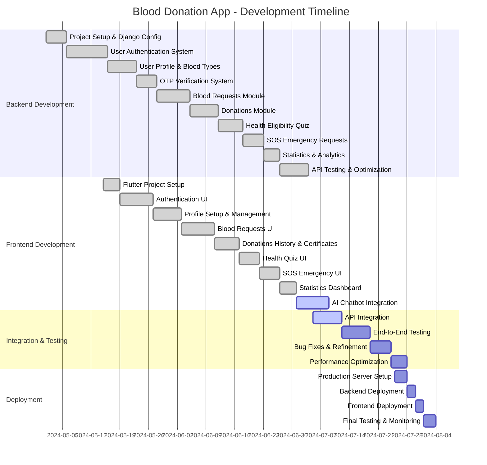

# Blood Donation App - Project Gantt Chart

## Overview

This document presents the project timeline and development phases for the Blood Donation Application.

## Project Timeline (Mermaid Gantt Chart)



## Module Breakdown

### Backend Modules (Django)

| Module | Duration | Status | Key Features |
|--------|----------|--------|--------------|
| **Account** | 15 days | ✅ Complete | Email auth, OTP verification, User profiles |
| **Blood Requests** | 8 days | ✅ Complete | Request blood, Donor pledges, Status tracking |
| **Donations** | 7 days | ✅ Complete | Donation records, Certificates, History |
| **Health** | 6 days | ✅ Complete | Eligibility quiz, Health records |
| **SOS** | 5 days | ✅ Complete | Emergency requests, Real-time responses |
| **Stats** | 4 days | ✅ Complete | Analytics, Dashboard data |

### Frontend Modules (Flutter)

| Module | Duration | Status | Key Features |
|--------|----------|--------|--------------|
| **Authentication** | 8 days | ✅ Complete | Login, Register, Forgot Password, Profile Setup |
| **Blood Requests** | 8 days | ✅ Complete | Browse requests, Pledge to donate |
| **Donations** | 6 days | ✅ Complete | Donation history, Certificate view |
| **Health Quiz** | 5 days | ✅ Complete | Eligibility questionnaire |
| **SOS Emergency** | 5 days | ✅ Complete | Emergency blood request |
| **Statistics** | 4 days | ✅ Complete | Dashboard, Analytics |
| **AI Chatbot** | 8 days | 🔄 In Progress | AI assistant for queries |

## Project Status Summary

### Completed (✅)
- [x] Django REST Framework Backend
- [x] User Authentication (Email + OTP)
- [x] Blood Request System
- [x] Donation Tracking & Certificates
- [x] Health Eligibility Quiz
- [x] Emergency SOS Requests
- [x] Basic Flutter UI Screens
- [x] API Integration (Partial)

### In Progress (🔄)
- [ ] AI Chatbot Integration
- [ ] Complete API Integration
- [ ] End-to-End Testing

### Pending (⏳)
- [ ] Bug Fixes & Refinement
- [ ] Performance Optimization
- [ ] Production Deployment
- [ ] Final Testing & Monitoring

## Critical Path

The critical path for project completion:

```
Project Setup → Auth System → API Development → Frontend Integration → Testing → Deployment
```

## Resource Allocation

| Role | Tasks | Time Allocation |
|------|-------|-----------------|
| Backend Developer | Django APIs, Database, Testing | 60 days |
| Frontend Developer | Flutter UI, State Management | 55 days |
| DevOps Engineer | Deployment, CI/CD, Monitoring | 10 days |
| QA Engineer | Testing, Bug Reporting | 15 days |

## Milestones

1. **M1: Backend API Complete** - June 27, 2024 ✅
2. **M2: Frontend UI Complete** - July 1, 2024 ✅
3. **M3: Integration Complete** - July 15, 2024 🔄
4. **M4: Production Ready** - July 30, 2024 ⏳

## Notes

- All dates are estimated based on typical development velocity
- The project uses Django REST Framework for backend
- Flutter is used for cross-platform mobile app
- SQLite is used for development (PostgreSQL recommended for production)
- Real-time features (SOS responses) may require additional infrastructure
